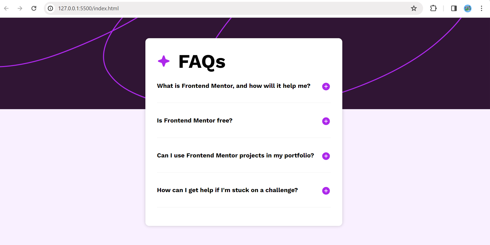

# Frontend Mentor - FAQ accordion solution

This is a solution to the [FAQ accordion challenge on Frontend Mentor](https://www.frontendmentor.io/challenges/faq-accordion-wyfFdeBwBz). Frontend Mentor challenges help you improve your coding skills by building realistic projects. 

## Table of contents

- [Overview](#overview)
  - [The challenge](#the-challenge)
  - [Screenshot](#screenshot)
  - [Links](#links)
- [My process](#my-process)
  - [Built with](#built-with)
  - [What I learned](#what-i-learned)
  - [Continued development](#continued-development)
  - [Useful resources](#useful-resources)
- [Author](#author)
- [Acknowledgments](#acknowledgments)


## Overview

### The challenge

Users should be able to:

- Hide/Show the answer to a question when the question is clicked
- Navigate the questions and hide/show answers using keyboard navigation alone
- View the optimal layout for the interface depending on their device's screen size
- See hover and focus states for all interactive elements on the page

### Screenshot




### Links

- Solution URL: [ solution URL here](https://your-solution-url.com)
- Live Site URL: [ live site URL here](https://your-live-site-url.com)

## My process

### Built with

- Semantic HTML5 markup
- CSS custom properties(transitions etc.)
- Flexbox
- CSS
- Google Fonts(for fonts)
- Javascript 

### What I learned
During this project, I gained a deeper understanding of several CSS properties and JavaScript methods, which significantly enhanced my web development skills.
CSS transitions allow HTML elements to gradually change from one style to another. I learned how to apply transitions to different CSS properties and control the speed of the transition.
```css
.question::after {
    ...
    transition: transform 0.3s, color 0.3s;
}
The classList.toggle method in JavaScript adds a class to an element if it does not already have it, and removes it if it does. This is particularly useful for interactive elements, like the items in an FAQ accordion.


faqItems[i].addEventListener('click', function () {
    this.classList.toggle('active');
});


### Continued development
I think i will focus more on responsivenes and transitions and javascript ,Dom manipulation because i have just started the javascript that's why i dont have good knowledge of js and i am looking forward to know it .

### Useful resources

- [Example resource 1](https://www.w3schools.com/) - This helped me for css properties . I really liked this documentation and will use it going forward.

## Author

- Website - [Anujkumar](https://www.your-site.com)
- Frontend Mentor - [@anuj846k](https://www.frontendmentor.io/profile/anuj846kk)
- Twitter - [@anuj846kk](https://www.twitter.com/anuj846kk)


## Acknowledgments

I believe that seeking help and learning from others is an integral part of the development journey. In this project, I sought assistance from Bing AI, which helped me understand and apply the concepts effectively. This not only helped me overcome the challenges I was facing in the project but also contributed to my growth as a developer.